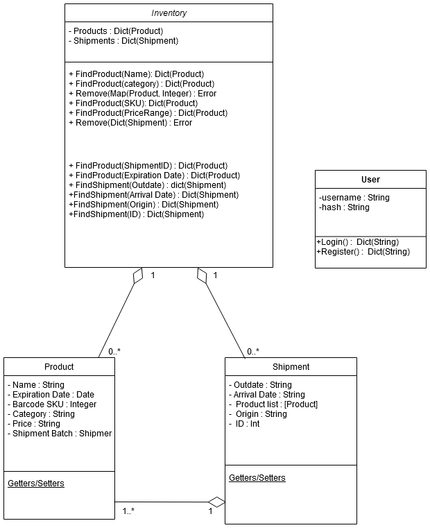

# csc-307
### Project Description

This project offers a fairly simple login/register interface, and authentication-protected views of a database describing various products of a template store's inventory. Users can login, logout, view the list of products and their various properties, filter the list using multiple filter criteria, and edit properties of a particular product.

### Figma Prototype
[Figma link](https://www.figma.com/file/QQCNWJnSh4qpgdr3v2G1LP/Untitled?node-id=0%3A1) Time estimate as described in [issue #2](https://github.com/Bob-Loth/csc-307/issues/2) (3 hours estimated, 4 hours actual)

### CI status
| Branch | Status |
|---|---|
|dev||
|main| |
|bob||
|david||

### Style Guide

For code submitted to frontend, we plan on using the recommended settings for eslint and the react-plugin for eslint.

For code submitted to backend, we plan on conforming to the pep8 standard by usage of pycodestyle, formerly known as pep8 (pip install pycodestyle)

### Use Case Diagram
.png)
### Class Diagram

